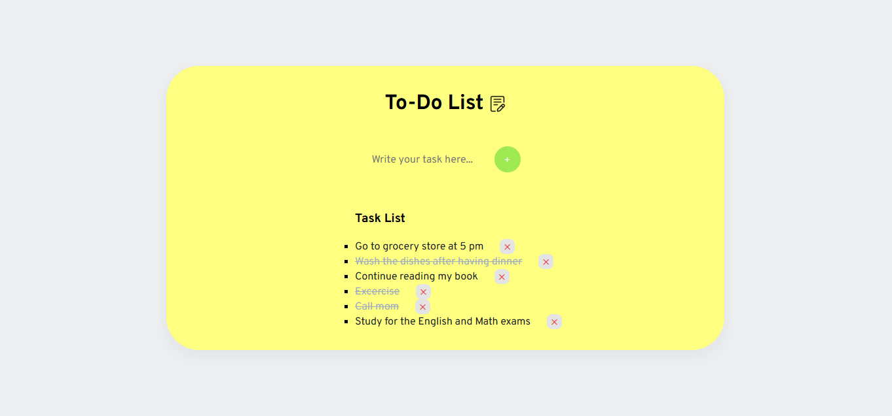

# To-Do-list-
A simple and responsive To-Do List web application built using vanilla HTML, CSS, and JavaScript.

## ✨ Features

- **Add & Remove Tasks:** Quickly add new items and clear out finished tasks.
- **Task Completion:** Mark tasks as completed with a visual check.
- **Data Persistence:** Uses browser `localStorage` to save your tasks across page reloads.
- **Responsive Layout:** Clean design that adapts seamlessly to desktop and mobile screens.

------
## 🛠️ Tech Stack

- **HTML5:** Semantic structure and input controls.
- **CSS3:** Custom styling, Flexbox layout, and smooth transitions.
- **JavaScript (ES6+):** DOM manipulation, event handling, and browser storage.

---
## 🚀 How to Run Locally

Because this app relies solely on vanilla web technologies, no installation or package managers are needed!

Open the app:
Double-click index.html to open it directly in any browser (or use the VS Code Live Server extension)

This is how it looks.

**Clone the repository:**

git clone [https://github.com/Androe8/To-Do-list-.git]

👤  Author
 Github : @Androe8

 
